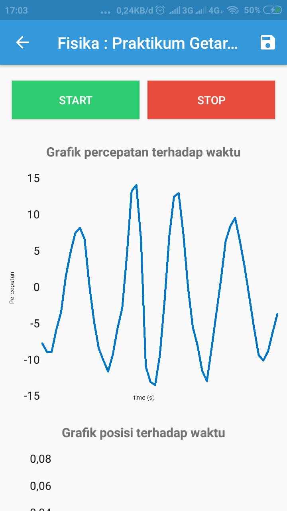
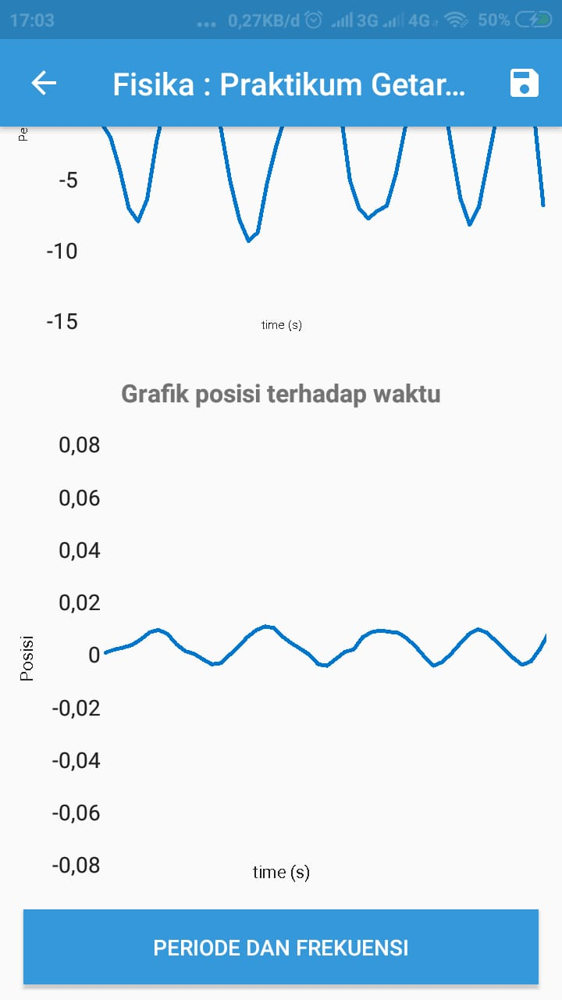
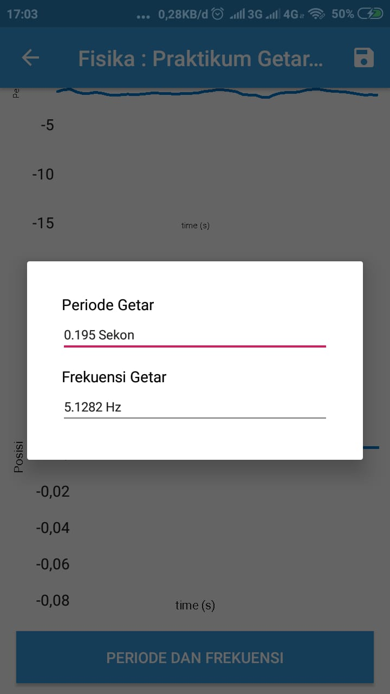
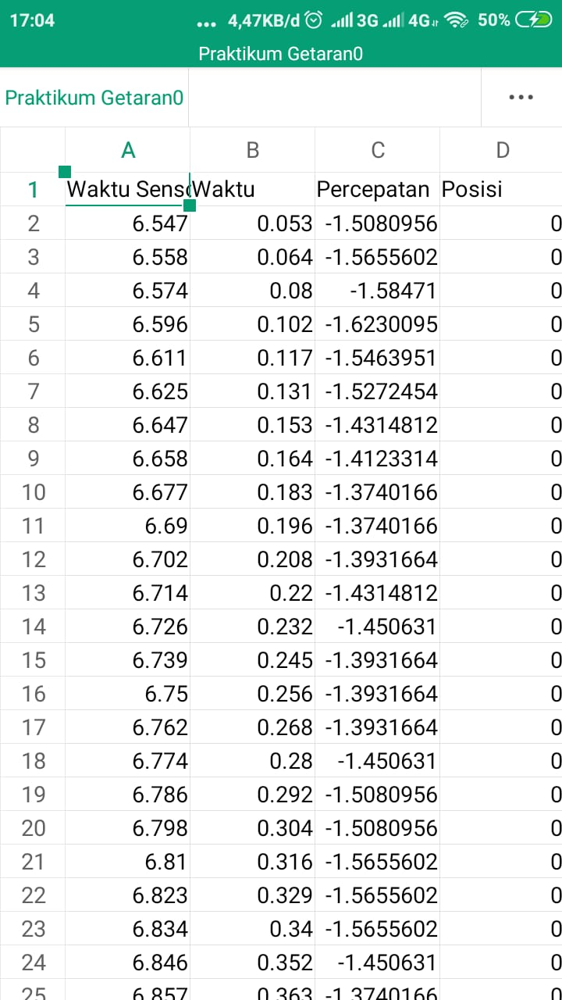
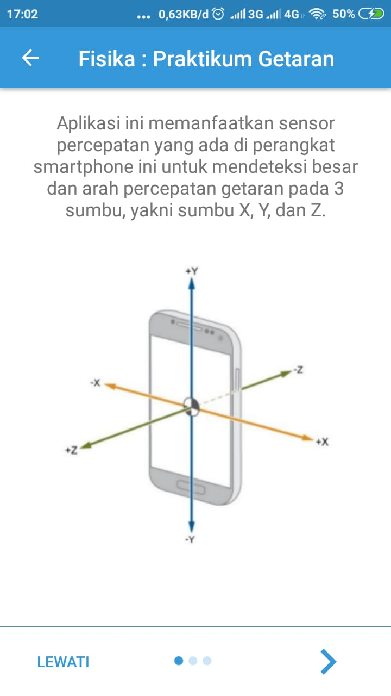
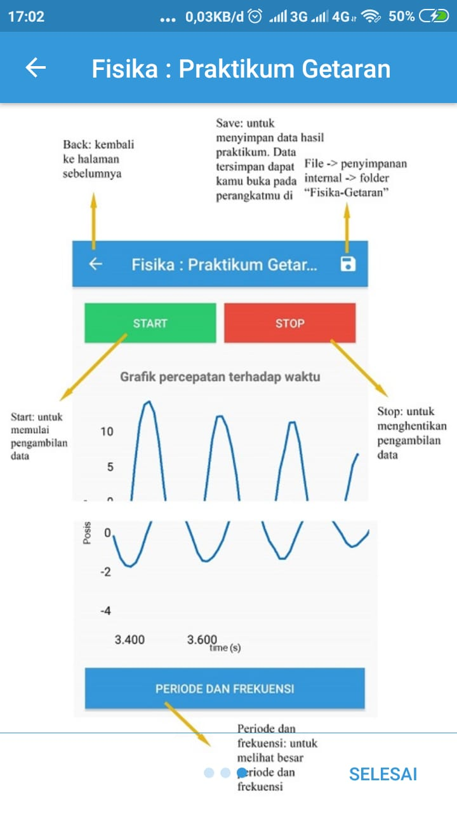

<h1 align="center">
Fisika-Accelerometer
</h1>

## Screenshots

  
  
  
  
  
  
  
  

## Features

- [x] Graph using accelerometer sensor
- [x] Export to excel

## Tech Stack

- [x] Java

## Author

| [ <b>Angga Riansah</b>](https://github.com/anggariansah)  | [ <b>Alvin Tandiardi</b>](https://github.com/alvintan05)  |
| :-----------------------------------------------------------------------------------------------------------------------------------------------------------------: | :-----------------------------------------------------------------------------------------------------------------------------------------------------------------------: |